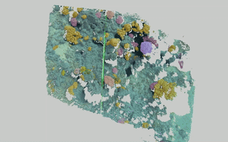

# Projecting Coralscapes Segmentations onto 3D Point Clouds



This is a quick and dirty small demo repository showing how the segmentations from [the Coralscapes dataset](https://josauder.github.io/coralscapes/) (Sauder et al. 2025) can be used to enrich photogrammetric 3D point clouds with semantic information.

## Pre-requisites:

### Dependencies
Make sure you have [GLOMAP](https://github.com/colmap/glomap) installed.

Install dependencies:
```pip install torch scipy open3d pandas transformers numpy```

### Images

Either choose your own image folder, or download the example images from [here](https://drive.google.com/drive/folders/1RyCoHPysVLTePbG4AVWc1VjT8el2suUJ?usp=sharing)! These images should be amenable to 3D reconstruction via Structure-from-Motion, so [ideally downward facing, high overlap, and good visibility](https://besjournals.onlinelibrary.wiley.com/doi/full/10.1111/2041-210X.13476).

## Running
The script will simply align the images using GLOMAP, run dense MVS with COLMAP, and then project the segmentations into the dense point cloud. Simply put in the correct paths and run:

```python3 main.py --images /path/to/image/folder --workspace /path/to/tmp/folder```

After running, the point cloud should appear in the workspace folder, and you can visualize it with CloudCompare etc.

## Citation

If you use this in your work, please cite:

```Sauder, Jonathan, et al. "The Coralscapes Dataset: Semantic Scene Understanding in Coral Reefs." arXiv preprint arXiv:2503.20000 (2025).```    

or for bibtex:

```
@misc{sauder2025coralscapesdatasetsemanticscene,
  title={The Coralscapes Dataset: Semantic Scene Understanding in Coral Reefs}, 
  author={Jonathan Sauder and Viktor Domazetoski and Guilhem Banc-Prandi and Gabriela Perna and Anders Meibom and Devis Tuia},
  year={2025},
  eprint={2503.20000},
  archivePrefix={arXiv},
  primaryClass={cs.CV},
  url={https://arxiv.org/abs/2503.20000}, 
}
```
